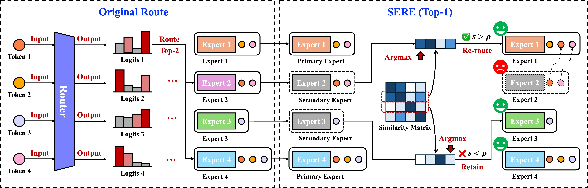

# SERE: Similarity-Based Expert Re-routing for Efficient Batch Decoding in MoE Models

[](https://openreview.net/forum?id=98IxaUQtMY)

**If our project helps you, please give us a star ⭐ and cite our <a href="#citation">paper</a>!**

## News
- **[2026.01.26]**: 🎉 Our paper is accepted to ICLR 2026!

## Introduction

Mixture-of-Experts (MoE) architectures employ sparse activation to deliver faster training and inference with higher accuracy than dense LLMs. However, in production serving, batch inference causes excessive expert activation during the memory-bound decoding stage, creating a fundamental tension between batch efficiency and expert sparsity.

We propose **SERE**, a **S**imilarity-based **E**xpert **R**e-routing method for **E**fficient batch decoding in MoE models. SERE dynamically reduces active experts by re-routing tokens from secondary experts to their most similar primary counterparts, while preserving critical experts to prevent capability degradation.

Key features:
+ **Dynamic expert skipping** based on batch-level redundancy, adapting to different input patterns
+ **Critical expert preservation** using similarity-based identification
+ **Plug-and-play integration** into vLLM with a single-line code change via efficient CUDA kernel

Experimental results demonstrate up to **2.0×** speedup with minimal quality loss across multiple MoE models.



## Method

SERE is motivated by three key observations. First, many experts exhibit high functional similarity and can substitute for each other. Second, high-ranked primary experts dominate output contributions while secondary experts contribute less. Third, certain critical experts are highly dissimilar and must be preserved.

As illustrated above, SERE operates in three steps:

1. **Primary Expert Selection**: Identify the union of top-S experts across all tokens in a batch as primary experts that are always retained.

2. **Similarity-based Re-routing**: For each secondary expert, find its most similar primary expert using pre-computed similarity matrices. If similarity exceeds threshold ρ, re-route tokens to the primary expert; otherwise preserve it as a critical expert.

3. **Final Execution**: Execute all primary experts and preserved critical experts.

The similarity matrices are pre-computed once from a calibration dataset, requiring no retraining or task-specific tuning.

## Getting Started

### Prerequisites

- Python 3.10.16
- PyTorch 2.6.0
- CUDA 12.4
- Transformers 4.52.3
- vLLM 0.8.4 (v0 backend)
- GCC/G++ 7.0+ (for compiling CUDA extensions, C++17 support required)

### Installation

Clone the repository:

```bash
git clone https://github.com/your-org/SERE.git
cd SERE
```

## Usage

This codebase provides three main components: expert similarity calibration, vLLM integration with SERE support, and evaluation scripts. Follow the instructions below to use SERE with your MoE models.

### Step 1: Expert Similarity Calibration

First, compute expert similarity matrices for your MoE model using a calibration dataset.

You can create a paper-style text calibration set from WikiText or C4 and run calibration in one command:

```bash
# WikiText example
python scripts/run_calibration_sere.py \
    --model_type qwen3_moe \
    --model_path Qwen/Qwen3-30B-A3B-Instruct-2507 \
    --output_path ./calibration/output/qwen3_sere_wikitext \
    --dataset wikitext \
    --config wikitext-103-raw-v1 \
    --split train \
    --num_calibration_samples 2048 \
    --max_calibration_bytes 95000000 \
    --similarity_method frobenius \
    --batch_size 32 \
    --max_len 512

# C4 example
python scripts/run_calibration_sere.py \
    --model_type qwen3_moe \
    --model_path Qwen/Qwen3-30B-A3B-Instruct-2507 \
    --output_path ./calibration/output/qwen3_sere_c4 \
    --dataset allenai/c4 \
    --config en \
    --split train \
    --streaming \
    --num_calibration_samples 2048 \
    --max_calibration_bytes 95000000 \
    --similarity_method frobenius \
    --batch_size 32 \
    --max_len 512
```

If you only need to materialize the parquet used by the original calibration script:

```bash
python scripts/prepare_calibration_data.py \
    --dataset wikitext \
    --config wikitext-103-raw-v1 \
    --split train \
    --model_path Qwen/Qwen3-30B-A3B-Instruct-2507 \
    --min_tokens 513 \
    --max_samples 2048 \
    --max_text_bytes 95000000 \
    --output_path ./calibration/data/wikitext_calibration.parquet
```

```bash
cd calibration

# For Qwen2-MoE models
python cal_expert_similarity.py \
    --model_type qwen2_moe \
    --model_path Qwen/Qwen1.5-MoE-A2.7B \
    --output_path ./output/qwen2_moe_similarity \
    --data_path ./data/calibration_data.parquet \
    --similarity_method cka \
    --kernel linear \
    --batch_size 100 \
    --max_len 128

# For DeepSeek-V2 models
python cal_expert_similarity.py \
    --model_type deepseek_v2 \
    --model_path deepseek-ai/DeepSeek-V2-Lite \
    --output_path ./output/deepseek_v2_similarity \
    --data_path ./data/calibration_data.parquet \
    --similarity_method cosine \
    --batch_size 50 \
    --max_len 256

# For Qwen3-MoE models
python cal_expert_similarity.py \
    --model_type qwen3_moe \
    --model_path Qwen/Qwen3-MoE-15B-A2B \
    --output_path ./output/qwen3_moe_similarity \
    --data_path ./data/calibration_data.parquet \
    --similarity_method frobenius \
    --batch_size 32 \
    --max_len 512
```

The calibration script will save the model with computed similarity matrices to the output path. See [calibration/README.md](calibration/README.md) for more details.

### Step 2: Install vLLM with SERE Support

Install the SERE plugin for vLLM:

```bash
cd vllm
pip install .
```

This will install the SERE plugin with custom CUDA kernels that enable SERE acceleration for Qwen2-MoE, Qwen3-MoE, and DeepSeek-V2 models in vLLM.

**Important**: SERE requires vLLM v0 backend. Set the environment variable before running inference:

```bash
export VLLM_USE_V1=0
```

See [vllm/README.md](vllm/README.md) for more details.

### Step 3: Run Inference with SERE

**Offline Inference**

Use SERE for offline batch inference:

```python
import os
os.environ["VLLM_USE_V1"] = "0"  # Use vLLM v0 backend

from vllm import LLM, SamplingParams

# Initialize vLLM with SERE enabled
llm = LLM(
    model="path/to/calibrated/model",  # Use the output from Step 1
    tensor_parallel_size=1,
    gpu_memory_utilization=0.9,
    trust_remote_code=True,
    hf_overrides={
        "architectures": ["Qwen2MoeForCausalLMSERE"],
        "select_top_k": 1,  # Number of primary experts to retain
        "threshold": 0.1    # Similarity threshold for critical expert preservation
    },
)

# Format input prompts
prompts = [
    "Hello, my name is",
    "The weather today is",
    "The future of technology is",
]

# Create sampling parameters
sampling_params = SamplingParams(max_tokens=50, temperature=0.0)

# Perform batch inference with SERE acceleration
outputs = llm.generate(prompts, sampling_params)

for output in outputs:
    print(f"Prompt: {output.prompt!r}")
    print(f"Generated: {output.outputs[0].text!r}")
    print("-" * 50)
```

**Online Deployment**

Deploy SERE-accelerated models via API server:

```bash
export VLLM_USE_V1=0  # Use vLLM v0 backend

vllm serve \
    path/to/calibrated/model \
    --trust-remote-code \
    --tensor-parallel-size 1 \
    --disable-log-requests \
    --max-model-len 4096 \
    --gpu-memory-utilization 0.95 \
    --hf-overrides '{"architectures": ["Qwen2MoeForCausalLMSERE"], "select_top_k": 2, "threshold": 0.0}'
```

**Offline MMLU Evaluation**

After installing the SERE vLLM plugin, evaluate a calibrated model with offline vLLM inference:

```bash
VLLM_USE_V1=0 python scripts/run_mmlu_offline_sere.py \
    --model ./calibration/output/qwen3_sere_c4 \
    --model_type qwen3_moe \
    --config all \
    --eval_split test \
    --num_fewshot 5 \
    --scoring_mode choice \
    --tensor_parallel_size 1 \
    --batch_size 64 \
    --select_top_k 2 \
    --threshold 0.1
```

The default `--scoring_mode choice` performs one constrained A/B/C/D generation per
question. Use `--scoring_mode exact` only when you need exact continuation
log-likelihood scoring; it sends four requests per question. The script writes
`results.json` and per-sample predictions under `outputs/mmlu_sere/`.

### Step 4: Evaluation with OpenCompass

Evaluate SERE-accelerated models on comprehensive benchmarks using OpenCompass:

```bash
cd experiments/opencompass

# Evaluate DeepSeek V2 with SERE
opencompass eval_deepseek_v2.py --work-dir ./results/deepseek_v2/ --mode all --reuse

# Evaluate Qwen 1.5 MoE with SERE
opencompass eval_qwen1_5.py --work-dir ./results/qwen1_5/ --mode all --reuse

# Evaluate Qwen 3 MoE with SERE
opencompass eval_qwen3.py --work-dir ./results/qwen3/ --mode all --reuse

# Or run all evaluations in batch
chmod +x run_exps.sh
./run_exps.sh
```
Benchmarks include: CMMLU, BoolQ, BBH, MATH, GSM8K, MATH401, HumanEval, MBPP.

See [experiments/opencompass/README.md](experiments/opencompass/README.md) for more details on evaluation configurations and metrics.


## Supported Models

SERE currently supports the following MoE models:

| Model | Activated Experts / Total Experts | Activated Params / Total Params | HuggingFace |
| ----- | --------------------------------- | ------------------------------- | ----------- |
| Qwen1.5-MoE-A2.7B-Chat | 4 / 60 + 4 Shared | 2.7B / 14.3B | [Qwen/Qwen1.5-MoE-A2.7B-Chat](https://huggingface.co/Qwen/Qwen1.5-MoE-A2.7B-Chat) |
| DeepSeek-V2-Lite-Chat | 6 / 64 + 2 Shared | 2.4B / 16B | [deepseek-ai/DeepSeek-V2-Lite-Chat](https://huggingface.co/deepseek-ai/DeepSeek-V2-Lite-Chat) |
| Qwen3-30B-A3B-Instruct | 8 / 128 | 3B / 30B | [Qwen/Qwen3-30B-A3B-Instruct-2507](https://huggingface.co/Qwen/Qwen3-30B-A3B-Instruct-2507) |

To adapt SERE to other MoE models, you can refer to the provided architectures and create custom modeling files following the same pattern.

## Citation

If you find SERE useful in your research, please cite our paper:

```bibtex
@inproceedings{wu2026sere,
  title={SERE: Similarity-based Expert Re-routing for Efficient Batch Decoding in MoE Models},
  author={Juntong Wu and Jialiang Cheng and Fuyu Lv and Dan Ou and Li Yuan},
  booktitle={The Fourteenth International Conference on Learning Representations},
  year={2026},
  url={https://openreview.net/forum?id=98IxaUQtMY}
}
```


## License

This project is licensed under the MIT License - see the LICENSE file for details.

## Acknowledgments

We thank the developers of [vLLM](https://github.com/vllm-project/vllm), [Transformers](https://github.com/huggingface/transformers), and [OpenCompass](https://github.com/open-compass/opencompass) for their excellent frameworks that made this work possible.
